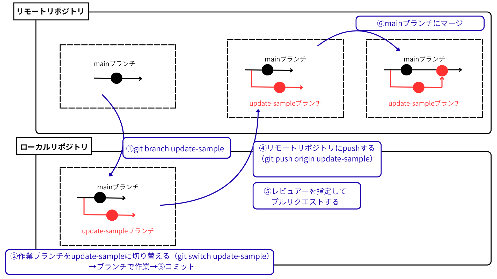
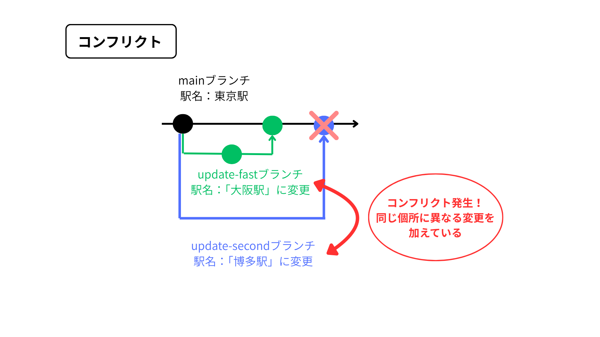

# ブランチ
Gitの履歴を枝分かれさせて開発を進めるための機能。main(mastar)ブランチから枝分かれさせて作業。
同時に複数人で作業する時やテスト環境と本番環境で異なるバージョンを動かす時など
２つ目のトピックブランチを作成する時もベースブランチからブランチ作業をする。（トピックブランチからブランチをしてしまうとベースがトピックブランチの内容になってしまうため）

## ベースブランチ
変更を取り込みたい側（mainブランチになること多い）

## トピックブランチ
作業するために分岐したブランチ


# ブランチ作成手順
1. ブランチ（update-sample）を作成
```bash
git branch update-sample
```

2. mainブランチから作成したブランチ（update-sample）に操作対象を切り替える
```bash
git switch update-sample
```

※作成したブランチ一覧と現在使用中のブランチの確認方法
```bash
git branch
```
現在使用中のブランチには（*）が付く


# プルリクエスト
作成（または変更）したブランチをmainブランチへマージする前に他の人にレビュー（チェック）してもらうリクエスト
レビューする側をレビュアー、レビューされる側をレビュイーという

# プッシュ
ローカルリポジトリの変更をリモートリポジトリに反映する操作
プッシュ後、リモートリポジトリにも同じ内容のブランチが作成される
```bash
git push origin update-sample
```


# マージ
ブランチで作成していた内容をmainブランチに統合すること
GitHub上で行えるマージの種類は、「Create a merge commit」「Squash and merge」「Rebase and merge」の３種類

## Create a merge commit
操作の履歴が残った状態（枝分かれの状態の履歴が残る）でマージする。コミット単位の見直しやバージョン切り替え可能。

## Squash and merge
トピックブランチで追加したコミットを１つにまとめて（スカッシュ）からベースブランチにマージする。

## Rebase and merge
トピックブランチのコミットをベースブランチの最新の履歴の上に並び替えて（リベース）そのままマージする。
履歴を一直線上に並び替える。


# ブランチ～マージまでの手順
1. mainブランチから新しいブランチ（update-sample）を作成して切り替える
2. 切り替えたブランチで作業（追加・編集）
3. コミットする
4. リモートリポジトリにpushする（切り替えたブランチと作業内容が反映される）
5. レビュアーを指定してプルリクエストを作成する
6. レビューOK
7. mainブランチにマージ




# リモートリポジトリの最新状態をローカルリポジトリに反映させる２種類の方法

## プル
最新状態を取得して現在のブランチにマージしてワークツリーに反映
フェッチとマージの両方の処理が含まれている

## フェッチ
最新状態の情報だけ取って、ワークツリーには反映はされない


# コンフリクト
マージ、リベース、プルなど統合する際に発生しうる現象
統合したい２つのブランチがそれぞれ同じ箇所に異なる変更を加えていた場合、Gitはどちらの変更を残すのか判断できないため、手動で解決する必要がある。

