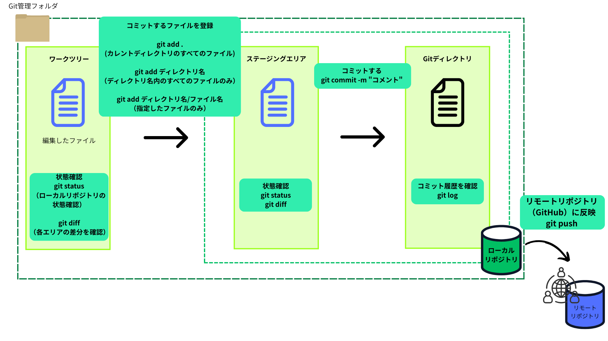
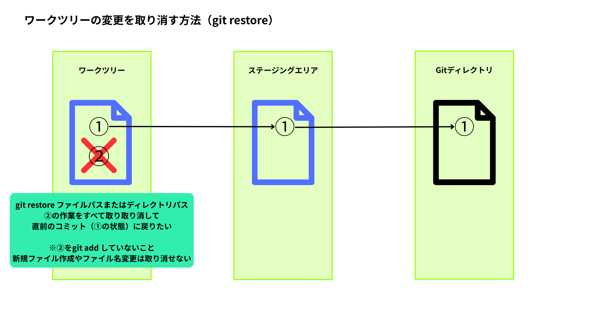

# ローカルリポジトリ

## 操作基本
コマンドラインに書いた内容を意識しながら操作
そのため操作前に現在地（pwd）の確認が大事

- git init：リポジトリ作成

- git add ディレクトリ名やファイル名：ステージングエリアに変更を登録
- git commit -m "コメント"：コメントを付けてコミット作成
- git rm ファイルパス：指定したファイル削除（削除後コミットを行う）
- git rm -r ディレクトリパス：指定したフォルダ削除（削除後コミットを行う）

- git status：ローカルリポジトリの状態確認
- git diff：ワークツリーとステージングエリアの差分確認
- git diff --staged：ステージングエリアとコミットの差分確認
- git log：コミットの履歴確認

- git restore ファイルパスやディレクトリパス：ワークツリーの変更を取り消す
- git restore --staged ファイルパスやディレクトリパス：ステージングエリアに追加した変更をワークツリーに戻す

- git branch：ブランチ一覧表示
- git switch：ブランチ切り替え

## Gitで管理しないファイル
バージョン管理すべきでないファイルをステージングエリアに登録しない方法
1. 「.gitignore」ファイルを作成
2. .gitignoreファイルに管理を無視したいファイル名やディレクトリ名を書く

バージョン管理すべきでないファイル：環境ごとに変わる、自動生成される、サイズが大きい　など
例）Djangoアプリ
- __pycache__/
- db.sqlite3
- madia/